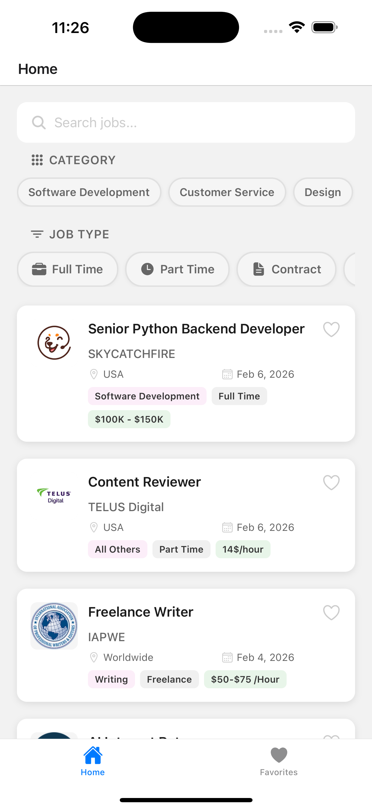

# Remote Jobs App

Aplicacion mobile para buscar trabajos remotos usando la API de Remotive.

## Demo




## Tech Stack

- **Framework:** Expo v54 con React Native 0.81
- **Navigation:** Expo Router v6 (file-based routing)
- **State Management:** Zustand v5
- **HTTP Client:** Axios
- **Storage:** AsyncStorage (persistencia de favoritos)
- **TypeScript:** Strict mode

## Arquitectura del Proyecto

El proyecto sigue una arquitectura **feature-based** (domain-driven), organizando el codigo por dominios de negocio.

```
app/                          # Expo Router - Paginas/Rutas
├── _layout.tsx               # Root layout (splash, fonts)
├── index.tsx                 # Redirect inicial
├── +not-found.tsx            # Pagina 404
├── detail/
│   └── [id].tsx              # Detalle de trabajo (ruta dinamica)
└── (tabs)/                   # Tab navigator group
    ├── _layout.tsx           # Configuracion de tabs
    ├── home.tsx              # Pantalla principal - Lista de trabajos
    └── favorite.tsx          # Pantalla de favoritos

features/                     # Modulos por dominio
├── jobs/                     # Dominio: Trabajos
│   ├── api/
│   │   └── jobs.ts           # Llamadas a la API (getJobs, getCategories)
│   ├── components/
│   │   ├── CategoryFilter/   # Filtro de categorias
│   │   ├── JobDetail/        # Componente de detalle
│   │   └── JobsCard/         # Card de trabajo
│   ├── store/
│   │   └── useJobStore.ts    # Store de Zustand para jobs
│   ├── utils/
│   │   ├── date.ts           # Utilidades de fecha
│   │   ├── transformData.ts  # Transformacion de datos
│   │   └── stylesHtml.ts     # Estilos para HTML render
│   └── type.ts               # Interfaces TypeScript
│
├── favorites/                # Dominio: Favoritos
│   └── store/
│       └── useFavoriteStore.ts  # Store persistido con AsyncStorage
│
└── shared/                   # Componentes compartidos
    ├── components/
    │   ├── EmptyState/       # Estado vacio
    │   ├── ErrorState/       # Estado de error
    │   ├── JobTypeFilter/    # Filtro por tipo de trabajo
    │   ├── LayoutBase/       # Layout base con scroll
    │   └── Searchbar/        # Barra de busqueda con debounce
    └── utils/
        └── constants.ts      # Constantes de la app

config/
└── axios.ts                  # Configuracion de Axios con headers

constants/
└── Colors.ts                 # Colores del tema (light/dark)
```

## Funcionalidades

- Listado de trabajos remotos
- Busqueda por titulo y nombre de empresa
- Filtro por categoria
- Filtro por tipo de trabajo (full-time, contract, etc.)
- Agregar/quitar favoritos (persistidos localmente)
- Pull to refresh
- Detalle de trabajo con descripcion HTML

## Requisitos

- Node.js >= 18
- Yarn o npm
- Expo CLI
- iOS Simulator / Android Emulator (opcional)

## Instalacion

1. Clonar el repositorio:

```bash
git clone https://github.com/efrencodes/prueba-rn-occ
cd prueba-rn-occ
```

2. Instalar dependencias:

```bash
yarn install
```

3. Configurar variables de entorno:
   Crear archivo `.env` en la raiz:

```env
EXPO_PUBLIC_URL_API_REMOTIVE=https://remotive.com/api
```

## Ejecucion

### Desarrollo

```bash
yarn start
```

### iOS

```bash
yarn ios
```

### Android

```bash
yarn android
```

### Web

```bash
yarn web
```

## Scripts Disponibles

| Script          | Descripcion                                 |
| --------------- | ------------------------------------------- |
| `yarn start`    | Inicia el servidor de desarrollo de Expo    |
| `yarn ios`      | Ejecuta la app en iOS                       |
| `yarn android`  | Ejecuta la app en Android                   |
| `yarn web`      | Ejecuta la app en navegador                 |
| `yarn lint`     | Verifica el formato del codigo con Prettier |
| `yarn format`   | Formatea el codigo con Prettier             |
| `yarn prebuild` | Genera los archivos nativos                 |

## API

La app consume la API de [Remotive](https://remotive.com/api/remote-jobs):

- `GET /remote-jobs` - Lista de trabajos
- `GET /remote-jobs/categories` - Lista de categorias

## Configuracion de Axios

El cliente HTTP esta configurado con headers personalizados:

```typescript
{
    'Content-Type': 'application/json',
    'Accept': 'application/json',
    'App-Version': 'v1.0.0',
    'Device-Name': Device.modelName,
    'Device-OS': `${Device.osName} ${Device.osVersion}`
}
```
